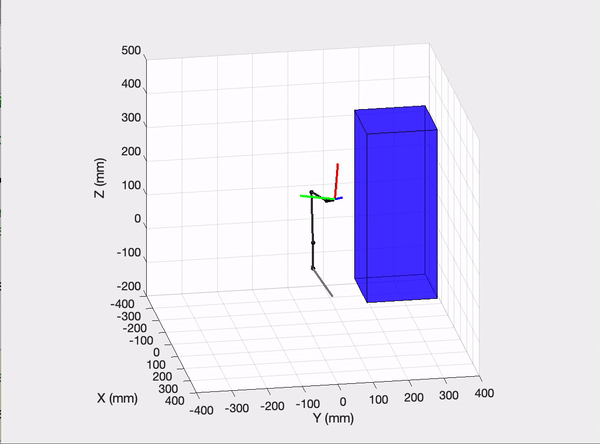
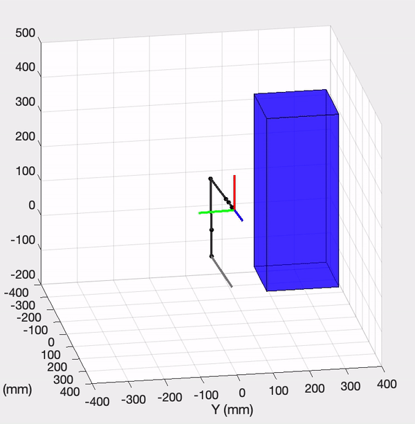
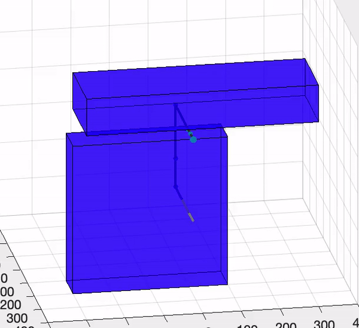

This is a dynamic smoothed-RRT planner for Lynx robot(6-DoF manipulator). 
 - Main functions:
   -  Simulation function: runsim.m
   -  Generative function for static planning(main function): SRRT.m
   -  Generative function for dynamic planning: regrow.m
 
- Other functions:
   -  Sample function: sample.m
   -  Pick random node in space: RandomNode.m
   -  Neighbor finding function: neighbor.m
   -  Node extending function: extend.m
   -  Collision detection function: DetCol.m
   -  Path optimization function: path_opt.m
   
- Utils:
Those are helper functions either from p-code or m-code that I implemented in the former labs

To evaluate the smoothness of the planner, we simulated in different static maps:

- static simulation results:

  - comparison between random sample and epsilon-greedy sample:
    
    

  - comparison between raw and pruned path:
  
    
    
    
To evaluate the dynamic performance of the planner, due to the fact that visualizing 3d moving obstacle in matlab is quite tricky, we implement it onto a planner dot robot navigating in changing environment and get the following result:

